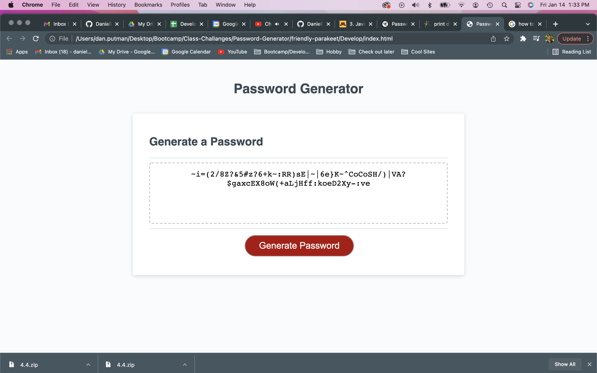

# Password Generator Starter Code
### Password Maker

This app is one that was created for a class assignment.  How it functions is that it prompts the user for various inputs, which work through a serious of "if" statements that pushes those into an array.  From there the array is shuffled and then printed.  I have a ton of help with this project that I can't claim that I "created" it as much as I worked through the process with others.  It does meet the requirements of the project though.   

## App Expectations:
- App prompts the user if they would like lowercase, uppercase, numeric and special characters and then responses with a password according to prompts.
- App creates a password between length of 8-128 characters.(with an exception)
- App displays the password where it should be displayed on the provided HTML.

## General reflections:
- This was a great started project for me.  Again, I had a lot of help so I would like to thank:
Andrew Jansen my friend and coding mentor
Telah Aliyev my coding tutor supplied with the U of M coding bootcamp
-website I sited in code for password shuffler

- There is one known bug with this app and that the array can not repeat characters that it displays.  Thus if you would like a password 11 characters long of solely numeric characters it will only display 10 characters because the array only lists 0-9.  I thought that a very elegant solution to this could be that I simpley copy and paste the content of the array to be atleast 129 characters long.  I decided against it because I know that would be a very poor practice coding wise.  

# Link to App:
<a href="https://danielp1742.github.io/Password-Maker/">Git Page</a>

# Screen Shot of App:
